# 广告灯控制器

## 实践项目意义

广告灯控制器项目是一个复杂且实用的电子工程设计案例，它展示了Verilog HDL在数字电路设计中的应用及其在实际生活中的重要性。通过这个项目，我们不仅能深入理解硬件描述语言的基本语法和设计思路，还能掌握数字电路的设计方法和技巧。该项目的设计目标是使用6个数码管和16个灯来组合至少8种以上的显示模式，展示出广告信息或其他需要显示的内容，从而实现信息的动态展示和有效传播。

该项目涉及到多种显示模式的设计与实现。通过8种以上的显示模式的组合，我们可以学到如何通过不同的控制逻辑来实现复杂的显示效果。这需要我们对状态机有深入的理解，掌握如何通过状态机来实现多种显示模式的切换和控制。例如，可以设计滚动显示、闪烁显示、流水灯显示等多种模式，通过Verilog HDL实现不同模式之间的切换和过渡。这不仅能培养我们的逻辑思维能力，还能提高他们对硬件电路设计的创新能力和解决问题的能力。

在这个项目中，我们使用了Quartus II软件进行设计和仿真。Quartus II是Altera公司开发的一款功能强大的FPGA设计软件，广泛应用于数字电路的开发和验证。通过使用Quartus II，我们可以进行硬件描述语言的编写、综合、布局布线和仿真，从而验证设计的正确性和性能。Quartus II提供了直观的图形界面和丰富的调试工具，使得我们可以方便地进行设计修改和优化，提高了设计效率和质量。

该项目还强调了系统设计与调试的重要性。由于广告灯控制器涉及到多个模块的协同工作，如数码管驱动模块、LED灯驱动模块、显示模式控制模块等，因此需要我们具备较强的系统设计能力。在设计过程中，我们需要考虑到各个模块之间的接口和通信，确保整个系统能够稳定、可靠地运行。同时，在调试过程中，我们还会遇到各种各样的问题，如信号干扰、时序错误等，这就需要我们具备一定的调试技巧和解决问题的能力。通过实际的设计与调试过程，我们可以积累丰富的实践经验，提升自身的工程素养和动手能力。

广告灯控制器项目还具有较高的应用价值和实用意义。在现代社会中，广告灯已经成为商业宣传的重要手段之一。通过设计一个高效、可靠的广告灯控制器，可以实现信息的高效传播，吸引更多的潜在客户。尤其是在商场、地铁站、机场等人流密集的场所，广告灯的显示效果直接影响到广告的传播效果和商业价值。因此，通过这个项目，我们不仅能学习到数字电路设计的理论知识，还能理解其在实际应用中的重要性，为未来的职业发展打下坚实的基础。

此外，该项目还具有一定的扩展性和灵活性。除了基本的数码管和LED灯的驱动与控制，我们还可以根据实际需要对系统进行扩展和改进。例如，可以增加更多的显示模式，丰富广告灯的显示效果。通过这些扩展功能的实现，我们可以进一步提升系统的功能性和智能化水平，从而更好地适应未来智能硬件的发展趋势。

总广告灯控制器项目是一个集理论学习与实践应用于一体的综合性设计项目。通过该项目的设计与实现，我们不仅能深入理解Verilog HDL在数字电路设计中的应用，还能掌握数码管和LED灯的驱动原理，学习多种显示模式的设计方法，提升系统设计与调试的能力。同时，该项目还具有较高的应用价值和实用意义，能够为我们未来的职业发展提供有力支持。在此基础上，我们还可以通过扩展和改进项目，进一步提升系统的功能性和智能化水平，从而更好地适应现代智能硬件的发展需求。

## 实践项目原理

### 实验硬件环境

#### 数码管的基础原理

**结构与工作原理**：

- 数码管是一种能够显示数字的光电显示装置，通常由7个LED（七段显示）和一个小数点组成，分别标记为a、b、c、d、e、f、g和dp（小数点）。
- 通过控制各段LED的点亮与否，可以显示0到9的数字以及部分字母（如A、b、C等）。

**4引脚数码管的编码方式**：

- 实验箱中使用的数码管有4个引脚，对应8、4、2、1，这种编码方式一般称为BCD（Binary-Coded Decimal，二进制编码十进制）。
- 在这种编码方式中，4个引脚的组合可以表示0到15之间的数值，但实际数码管只用来显示0到9，因此不会用到所有组合。

**控制原理**：

- 每个数码管的每一段（a-g和dp）连接到一个控制电路，控制电路根据输入的BCD编码决定哪些段应该点亮。
- 例如，输入为0001（二进制），表示数字1，对应的段码为b和c点亮，显示出数字1。
- 数码管内部有解码电路，将4引脚的BCD信号解码为7段显示。

#### LED灯的基础原理

**结构与工作原理**：

- LED（Light Emitting Diode，发光二极管）是一种能够发光的半导体器件，当正向电流通过时会发光。
- LED具有正负两个电极，分别是阳极（正极）和阴极（负极）。当正向电压加在LED两端时，电流通过发光二极管，发光二极管发光。

**驱动原理**：

- LED的发光强度与通过它的电流成正比。为了保护LED不被烧坏，需要通过电阻或专门的驱动芯片来限制电流。
- 多个LED可以串联或并联连接，通过不同的电路设计实现不同的发光效果，如流水灯、闪烁灯等。

**控制原理**：

- 每个LED的点亮与否由电流控制，通过开关或控制芯片控制电流的通断。
- 在数字电路中，常用GPIO（通用输入输出）口或PWM（脉宽调制）信号来控制LED的亮灭和亮度。

### Verilog HDL基本语法

Verilog HDL（硬件描述语言）是一种用于设计和描述数字电路的语言。它的语法和结构类似于编程语言，如C和Pascal，但它是专门为描述硬件行为而设计的。以下是Verilog HDL的一些基本语法和概念：

#### 模块

模块是Verilog代码的基本构建块，每个模块描述一个硬件单元。

```verilog
module module_name (port_list);
    // Port declarations
    input wire input_signal;
    output reg output_signal;
    
    // Internal signals
    wire internal_signal;
    
    // Behavioral or structural description
    always @(posedge clock) begin
        // Sequential logic
    end

    assign internal_signal = some_expression; // Combinational logic
endmodule
```

#### 端口声明

模块的端口用于连接外部信号，可以是输入、输出或双向端口。

```verilog
input wire input_signal;   // 输入端口
output reg output_signal;  // 输出端口
inout wire bidirectional_signal; // 双向端口
```

#### 数据类型

Verilog支持多种数据类型，包括：

- `wire`：表示连接和组合逻辑。
- `reg`：表示存储单元，用于时序逻辑。
- `integer`：用于整数。
- `real`：用于实数。

#### 运算符

Verilog支持各种运算符，包括：

- 算术运算符：`+`, `-`, `*`, `/`, `%`
- 逻辑运算符：`&&`, `||`, `!`
- 比较运算符：`==`, `!=`, `<`, `>`, `<=`, `>=`
- 位运算符：`&`, `|`, `^`, `~`, `<<`, `>>`

#### 赋值语句
- **连续赋值**：用于组合逻辑，用`assign`语句。

```verilog
assign output_signal = input_signal1 & input_signal2;
```

- **过程赋值**：用于时序逻辑，用`always`块内的`=`或`<=`语句。

```verilog
always @(posedge clock) begin
    reg_signal <= input_signal;
end
```

#### 条件语句
- `if-else`语句：

```verilog
always @(posedge clock) begin
    if (condition) begin
        // Statements
    end else begin
        // Statements
    end
end
```

- `case`语句：

```verilog
always @(posedge clock) begin
    case (control_signal)
        value1: // Statements
        value2: // Statements
        default: // Default statements
    endcase
end
```

#### 循环语句
- `for`循环：

```verilog
for (i = 0; i < N; i = i + 1) begin
    // Statements
end
```

- `while`循环：

```verilog
while (condition) begin
    // Statements
end
```

#### 时序控制
用于控制事件的发生时间：

- `@`事件控制符：

```verilog
always @(posedge clock or negedge reset) begin
    // Statements
end
```

#### 初始块
用于模拟仿真初始条件，只在仿真时执行一次。但是Quartus II中并不支持该语句，若使用该语句将被忽略不被实现。

```verilog
initial begin
    // Initial statements
end
```

### 模式选择、切换与实现

在广告灯控制器项目中，模式选择与切换是实现多种显示模式的关键。以下是该部分的详细原理：

#### **模式存储与表示**

所有的显示模式都需要有对应的编号或者标识符。在Verilog HDL中，可以使用`reg`变量来存储当前的显示模式。

例如，可以定义一个`current_mode`寄存器来存储当前的模式编号：

```verilog
reg [3:0] current_mode; // 假设有16种模式
```

#### **模式切换触发**

模式的切换可以由外部输入信号（如按键、开关）或者内部计数器等触发。

使用外部输入信号时，需要检测输入信号的变化，例如按键按下的边沿检测，可以使用`posedge`或者`negedge`检测上升沿或下降沿：

#### **模式切换的逻辑设计**

每种模式对应一种特定的显示状态组合，这些组合可以通过Verilog的条件语句（如`case`语句）进行选择：
```verilog
always @(mode) begin
    case (mode)
        4'b0000: begin
            // 定义模式0的显示逻辑
        end
        4'b0001: begin
            // 定义模式1的显示逻辑
        end
        // 其他模式的逻辑
        default: begin
            // 默认模式
        end
    endcase
end
```

#### **显示内容控制**

在每个模式下，需要定义数码管和LED灯的显示内容。这可以通过组合逻辑或时序逻辑来实现：
- 组合逻辑：直接根据模式编号决定显示内容。
- 时序逻辑：使用时钟信号驱动显示内容的变化，例如闪烁效果、流水灯效果等。

#### **时钟与计数器**

为了实现一些动态的显示效果，如闪烁或流水灯，需要使用时钟信号和计数器。

计数器可以用来生成不同的时间间隔，从而控制显示内容的动态变化：
```verilog
integer counter;
always @(posedge clk or posedge reset) begin
    if (reset) begin
        counter <= 32'b0;
    end else begin
        counter <= counter + 1;
    end
end
```

## 实践项目的设计

### 顶层设计

#### 顶层模块

 顶层模块 `ad_light_controller` 通过三个子模块实现了对数码管和LED灯的控制。`mode_fsm` 子模块负责处理模式选择信号并输出当前模式 `current_mode`。`digit_display` 子模块根据 `current_mode` 控制6个数码管的显示状态，通过 `digit_ctrl` 输出数码管控制信号。`led_display` 子模块也根据 `current_mode` 控制16个LED灯的显示状态，通过 `light_ctrl` 输出LED控制信号。顶层模块协调各个子模块，通过 `clk` 和 `rst_n` 信号同步操作，实现了模式选择、数码管显示和LED灯显示的功能集成。下面为顶层模块代码：

```verilog
module ad_light_controller(
    input wire clk,               // 时钟信号
    input wire rst_n,             // 复位信号，低电平有效
    input wire [3:0] mode_select, // 模式选择信号
    output wire [23:0] digit_ctrl,// 数码管控制信号（6个数码管，每个数码管4位）
    output wire [15:0] light_ctrl // 灯控制信号
);

    // 内部信号
    wire [3:0] current_mode;
    
    // 状态机模块实例
    mode_fsm u_mode_fsm(
        .clk(clk),
        .rst_n(rst_n),
        .mode_select(mode_select),
        .current_mode(current_mode)
    );
    
    // 数码管控制模块实例
    digit_display u_digit_display(
        .clk(clk),
        .rst_n(rst_n),
        .mode(current_mode),
        .digit_ctrl(digit_ctrl)
    );
    
    // LED控制模块实例
    led_display u_led_display(
        .clk(clk),
        .rst_n(rst_n),
        .mode(current_mode),
        .light_ctrl(light_ctrl)
    );

endmodule
```

#### 显示模式

1. 直接根据当前寄存器中存储的LED灯和数码管控制信息显示内容。
2. LED灯以固定模式0101010101010101亮起。每个数码管固定显示5。
3. LED灯表示为16位二进制，从0开始每次做自增1运算，运算结果为1的位所对应的灯亮起。每个数码管做递增1的运算。
4. LED灯表示为16位二进制，从0开始每次做自减1运算，运算结果为1的位所对应的灯亮起。每个数码管做递减1的运算。
5. LED灯表示为16位二进制，做左移一位运算。每个数码管做左移一位运算。
6. LED灯表示为16位二进制，做右移一位运算。每个数码管做右移一位运算。
7. LED灯表示为16位二进制，做取反运算。每个数码管做取反运算。
8. 将LED灯分为两部分，进行左右交换。每个数码管做左移两位运算。
9. 将LED灯分成4个部分，1和4，2和3部分对闪，即4为1的按位取反，3为2的按位取反。数码管中，1和6, 2和5, 3和4号数码管对闪，即6为1的对9取补，5为2的对9取补，4为3的对9取补。
10. LED灯由两边向中间亮起（亮过的灯不会熄灭所有的灯全部亮起后，统一熄灭）。数码管从两边向中间依次亮起，具体亮起规则如下：100001->200002->300003->410014->520025->630036->740047->851158->……->962269->000000。
11. LED灯由中间向两边亮起 （亮过的灯不会熄灭所有的灯全部亮起后，统一熄灭）。数码管从中间向两边依次亮起，具体亮起规则如下：001100->002200->003300->014410->025520->036630->047740->158851->……->269962-> 000000。
12. 将LED灯分为0000111100001111、1111000011110000、全亮和全灭四种模式，记作模式1234，分为6个节拍，亮起顺序为模式4->1->2->1->2->3->4。初始状态数码管全为1,从右向左依次变为0, 1, 2 ... 9。
13. 将LED灯分为左右两部分，左边从两边向中间亮起，右边从中间向两边亮起。初始状态数码管全为1,从左向右依次变为0, 1, 2 ... 9。

### 状态机模块

`mode_fsm` 模块是一个简单的状态机模块，通过时钟信号和复位信号控制状态的转移。在复位信号有效时，状态机会将 `current_mode` 复位为 `0`。在复位信号无效时，状态机会将 `current_mode` 设置为 `mode_select` 的值。这个模块的作用是根据输入的 `mode_select` 信号来确定当前的工作模式，并将其传递给其他模块（如数码管控制模块和LED控制模块）。下面为 `mode_fsm` 模块的代码：

```verilog
module mode_fsm(
    input wire clk,               // 时钟信号
    input wire rst_n,             // 复位信号，低电平有效
    input wire [3:0] mode_select, // 模式选择信号
    output reg [3:0] current_mode // 当前模式信号
);

    // 状态转移逻辑
    always @(posedge clk or negedge rst_n) begin
        if (!rst_n) begin
            current_mode <= 4'd0; // 复位时，将当前模式设为0
        end else begin
            current_mode <= mode_select; // 否则，将当前模式设为输入的模式选择信号
        end
    end
endmodule
```

#### 模块接口定义

1. **输入信号**：
   - `clk`：系统时钟信号。状态机的状态转移在时钟的上升沿触发。
   - `rst_n`：复位信号，低电平有效。当复位信号有效时，状态机将复位到初始状态。
   - `mode_select`：模式选择信号，用于设置系统的当前模式。

2. **输出信号**：
   - `current_mode`：当前模式信号。这个信号反映了状态机的当前状态，由 `mode_select` 输入信号决定。

#### 状态转移逻辑

- `always @(posedge clk or negedge rst_n)`：这个敏感度列表表示在时钟上升沿或者复位信号的下降沿时触发 `always` 块。
  - 如果复位信号 `rst_n` 为低（即复位有效），则 `current_mode` 被设置为 `4'd0`，表示复位状态。
  - 如果复位信号 `rst_n` 为高（即复位无效），则 `current_mode` 被设置为 `mode_select`，即输入的模式选择信号。

### 数码管控制模块

`digit_display` 模块通过 `clk` 和 `rst_n` 信号控制数码管的显示模式。根据输入的 `mode` 信号，数码管显示不同的内容或模式。输出信号 `digit_ctrl` 控制6个数码管的显示值。该模块的设计实现了多种显示模式，如固定显示、递增递减显示、循环左移右移等，通过明确的状态转换逻辑和组合逻辑实现数码管的动态显示效果。

#### 模块接口定义

```verilog
module digit_display(
    input wire clk,
    input wire rst_n,
    input wire [3:0] mode,
    output reg [23:0] digit_ctrl // 每个数码管4位，共6个数码管
);
```

1. **输入信号**：
   - `clk`：时钟信号。
   - `rst_n`：复位信号，低电平有效。
   - `mode`：模式选择信号，用于选择当前数码管显示模式。

2. **输出信号**：
   - `digit_ctrl`：24位数码管控制信号，用于控制6个数码管的显示内容（每个数码管4位）。

#### 内部信号和寄存器

```verilog
    reg [3:0] digits [5:0];  // 用于存储6个数码管的值
    reg [2:0] current_digit; // 当前数码管索引
    reg [3:0] value;         // 当前数码管的值
    reg [3:0] counter;       // 计数器

    integer i;
```

- `digits`：一个存储6个数码管值的数组，每个数码管4位。
- `current_digit`：当前数码管的索引。
- `value`：当前数码管的值。
- `counter`：计数器，用于模式9和10的计数。

#### 初始化数码管

```verilog
    initial begin
        for (i = 0; i < 6; i = i + 1) begin
            digits[i] = 4'd2;
        end
        current_digit = 3'd0;
        value = 4'd0;
        counter = 4'd0;
        i <= 0;
    end
```

- 初始化 `digits` 数组的所有元素为 `2`。
- 初始化 `current_digit`，`value`，和 `counter` 为 `0`。

#### 数码管动态变化逻辑

```verilog
    always @(posedge clk or negedge rst_n) begin
        if (!rst_n) begin
            for (i = 0; i < 6; i = i + 1) begin
                digits[i] <= 4'd0;
            end
        end else begin
            case (mode)
                // 各种模式下的数码管显示逻辑
            endcase
        end
    end
```

- 在时钟的上升沿或复位信号的下降沿触发。
- 如果复位信号有效，将所有 `digits` 置为 `0`。
- 否则，根据 `mode` 的值执行相应的数码管显示逻辑。

#### 各种模式下的数码管显示逻辑

- **模式0：直接根据当前寄存器中存储的LED灯和数码管控制信息显示内容**

```verilog
	4'd0: begin 
        // 空语句
    end
```

- **模式1：固定值0101**
```verilog
    4'd1: begin
        for (i = 0; i < 6; i = i + 1) begin
            digits[i] <= 4'b0101;
        end
    end
```

- **模式2：递增，循环**
```verilog
    4'd2: begin
        for (i = 0; i < 6; i = i + 1) begin
            if (digits[i] == 4'd9)
                digits[i] <= 4'd0;
            else
                digits[i] <= digits[i] + 4'd1;
        end
    end
```

- **模式3：递减，循环**
```verilog
    4'd3: begin
        for (i = 0; i < 6; i = i + 1) begin
            if (digits[i] == 4'd0)
                digits[i] <= 4'd9;
            else
                digits[i] <= digits[i] - 4'd1;
        end
    end
```

- **模式8：对闪**
```verilog
    4'd8: begin
        for (i = 0; i < 3; i = i + 1) begin
            digits[i] = counter;
        end
        for (i = 3; i < 6; i = i + 1) begin
            digits[i] = 4'd9 - counter;
        end

        if (counter < 4'd9) begin
            counter <= counter + 4'd1;
        end else begin
            counter <= 4'd0;
        end
    end
```

- **模式9：从两边向中间显示**
```verilog
    4'd9: begin
        if (counter < 4'd9) begin
            counter <= counter + 4'd1;
        end else begin
            counter <= 4'd0;
        end

        digits[0] <= counter;
        digits[5] <= counter;
        if (counter > 4'd3) begin
            digits[1] <= counter - 4'd3;
            digits[4] <= counter - 4'd3;
        end else begin
            digits[1] <= 4'd0;
            digits[4] <= 4'd0;
        end
        if (counter > 4'd7) begin
            digits[2] <= counter - 4'd7;
            digits[3] <= counter - 4'd7;
        end else begin
            digits[2] <= 4'd0;
            digits[3] <= 4'd0;
        end
    end
```

- **模式10：从中间向两边显示**
```verilog
    4'd10: begin
        if (counter < 4'd9) begin
            counter <= counter + 4'd1;
        end else begin
            counter <= 4'd0;
        end

        digits[2] <= counter;
        digits[3] <= counter;
        if (counter > 4'd3) begin
            digits[1] <= counter - 4'd3;
            digits[4] <= counter - 4'd3;
        end else begin
            digits[1] <= 4'd0;
            digits[4] <= 4'd0;
        end
        if (counter > 4'd7) begin
            digits[0] <= counter - 4'd7;
            digits[5] <= counter - 4'd7;
        end else begin
            digits[0] <= 4'd0;
            digits[5] <= 4'd0;
        end
    end
```

- **模式11：从左到右依次闪烁**

```verilog
    4'd11: begin
        if (current_digit < 3'd5) begin
            current_digit <= current_digit + 3'd1;
        end else begin
            current_digit <= 3'd0;
            value <= (value == 4'd8) ? 4'd0 : value + 4'd1;
        end

        digits[current_digit] <= value + 4'd1;
    end
```

- **模式12：从右到左依次闪烁**

```verilog
    4'd12: begin //从右到左依次闪烁
        if (current_digit < 3'd5) begin
            current_digit <= current_digit + 3'd1;
        end else begin
            current_digit <= 3'd0;
            value <= (value == 4'd8) ? 4'd0 : value + 4'd1;
        end
        digits[5 - current_digit] <= value + 4'd1;
    end
```

#### 将数码管值输出到 `digit_ctrl`

```verilog
    always @(*) begin
        for (i = 0; i < 6; i = i + 1) begin
            digit_ctrl[i*4 +: 4] = digits[i];
        end
    end
```

- 这个 `always` 块是组合逻辑，用于将 `digits` 数组的值映射到 `digit_ctrl` 输出信号中。
- 使用 `i*4 +: 4` 表示法，将 `digits[i]` 的4位值赋值到 `digit_ctrl` 的相应位置。

### LED控制模块

`led_display` 模块通过 `clk` 和 `rst_n` 信号控制LED的显示模式。根据输入的 `mode` 信号，LED显示不同的内容或模式。输出信号 `light_ctrl` 控制16个LED的显示状态。该模块的设计实现了多种显示模式，如固定显示、递增递减显示、循环左移右移、对闪、从两边往中间亮、从中间往两边亮、依次闪烁、左半边和右半边分别亮等，通过明确的状态转换逻辑和组合逻辑实现LED的动态显示效果。

#### 模块接口定义

```verilog
module led_display(
    input wire clk,
    input wire rst_n,
    input wire [3:0] mode,
    output reg [15:0] light_ctrl
);
```

1. **输入信号**：
   - `clk`：时钟信号。
   - `rst_n`：复位信号，低电平有效。
   - `mode`：模式选择信号，用于选择当前LED显示模式。

2. **输出信号**：
   - `light_ctrl`：16位LED控制信号，用于控制16个LED的显示状态。

#### 内部信号和寄存器

```verilog
    integer counter;
    integer i;
```

- `counter`：计数器，用于某些模式的计数。
- `i`：循环变量。

#### LED动态变化逻辑

```verilog
    always @(posedge clk or negedge rst_n) begin
        if (!rst_n) begin 
            light_ctrl <= 16'd0;
            counter <= 3'd0;
        end else begin
            case (mode)
                // 各种模式下的LED显示逻辑
            endcase
        end
    end
```

- 在时钟的上升沿或复位信号的下降沿触发。
- 如果复位信号有效，将 `light_ctrl` 置为 `0`，将 `counter` 置为 `0`。
- 否则，根据 `mode` 的值执行相应的LED显示逻辑。

#### 各种模式下的LED显示逻辑

以下是几种模式的显示逻辑示例：

- **模式1：固定值0101010101010101**
```verilog
    4'd1: light_ctrl <= 16'b0101010101010101;
```

- **模式2：递增**
```verilog
    4'd2: light_ctrl <= light_ctrl + 16'd1;
```

- **模式3：递减**
```verilog
    4'd3: light_ctrl <= light_ctrl - 16'd1;
```

- **模式4：循环左移**
```verilog
    4'd4: light_ctrl <= {light_ctrl[14:0], light_ctrl[15]};
```

- **模式5：循环右移**
```verilog
    4'd5: light_ctrl <= {light_ctrl[0], light_ctrl[15:1]};
```

- **模式6：按位取反**
```verilog
    4'd6: light_ctrl <= ~light_ctrl;
```

- **模式7：字节循环左移**
```verilog
    4'd7: light_ctrl <= {light_ctrl[7:0], light_ctrl[15:8]};
```

- **模式8：对闪**
```verilog
    4'd8: begin
        light_ctrl[15:12] <= ~light_ctrl[3:0];
        light_ctrl[11:8] <= ~light_ctrl[7:4];
        light_ctrl[7:4] <= ~light_ctrl[11:8];
        light_ctrl[3:0] <= ~light_ctrl[15:12];
    end
```

- **模式9：从两边往中间亮**
```verilog
    4'd9: begin
        light_ctrl <= 16'b0000000000000000;
        for (i = 0; i <= 7; i = i + 1) begin
            if (i <= counter) begin
                light_ctrl[i] <= 1'b1;
                light_ctrl[15-i] <= 1'b1;
            end
        end
        counter <= counter + 1;
        if (counter == 7) begin
            counter <= 0;
        end
    end
```

- **模式10：从中间往两边亮**
```verilog
    4'd10: begin
        light_ctrl <= 16'b0000000000000000;
        for (i = 0; i <= 7; i = i + 1) begin
            if (i <= counter) begin
                light_ctrl[7-i] <= 1'b1;
                light_ctrl[8+i] <= 1'b1;
            end
        end
        counter <= counter + 1;
        if (counter == 7) begin
            counter <= 0;
        end
    end
```

- **模式11：按照固定规律闪烁**
```verilog
    4'd11: begin 
        case (counter)
            3'd0: light_ctrl <= 16'b0000000000000000;  // All LEDs OFF
            3'd1: light_ctrl <= 16'b0000111100001111;  // Group 1 ON
            3'd2: light_ctrl <= 16'b1111000011110000;  // Group 2 ON
            3'd3: light_ctrl <= 16'b0000111100001111;  // Group 1 ON
            3'd4: light_ctrl <= 16'b1111000011110000;  // Group 2 ON
            3'd5: light_ctrl <= 16'b0000000000000000;  // All LEDs OFF
            3'd6: light_ctrl <= 16'b1111111111111111;  // All LEDs ON
            default: light_ctrl <= 16'b0000000000000000;
        endcase
        counter <= counter + 1;
        if (counter == 6) begin
            counter <= 0;
        end
    end
```

- **模式12：左半边和右半边分别亮**
```verilog
    4'd12: begin
        light_ctrl = 16'b0000000000000000;

        // 左半边灯从两边向中间依次亮
        for (i = 0; i <= 3; i = i + 1) begin
            if (i <= counter) begin
                light_ctrl[4 + i] = 1'b1;
                light_ctrl[3 - i] = 1'b1;
            end
        end

        // 右半边灯从中间向两边依次亮
        for (i = 0; i <= 3; i = i + 1) begin
            if (i <= counter) begin 
                light_ctrl[8 + i] = 1'b1;
                light_ctrl[15 - i] = 1'b1;
            end
        end

        counter <= counter + 1;
        if (counter == 3) begin
            counter <= 0;
        end
    end
```

## 实践项目调试过程

### 项目编译

编写好Verilog项目文件后，即可在Compiler Tool中编译项目。下图为项目编译成功的截图：

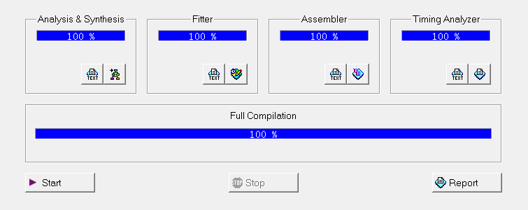

### 波形模拟

编译通过后，我们可以通过波形模拟来验证是项目功能是否与预期规划一致，下面为广告灯控制器在不同外界控制信号输入情况下的模拟输出结果：

1. 直接根据当前寄存器中存储的LED灯和数码管控制信息显示内容。

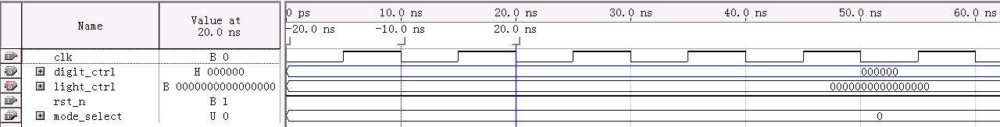

2. LED灯以固定模式0101010101010101亮起。每个数码管固定显示5。

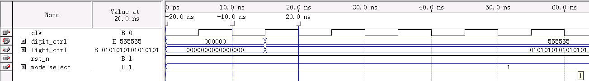

3. LED灯表示为16位二进制，从0开始每次做自增1运算，运算结果为1的位所对应的灯亮起。每个数码管做递增1的运算。

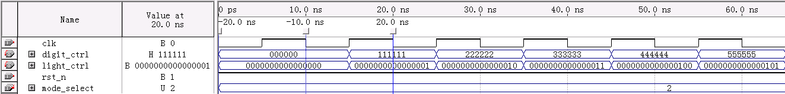

4. LED灯表示为16位二进制，从0开始每次做自减1运算，运算结果为1的位所对应的灯亮起。每个数码管做递减1的运算。

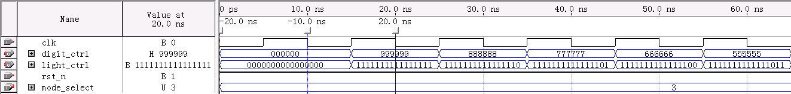

5. LED灯表示为16位二进制，做左移一位运算。每个数码管做左移一位运算。

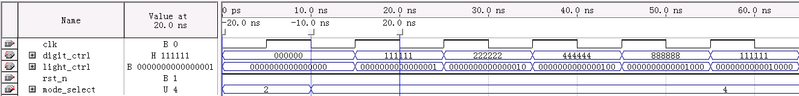

6. LED灯表示为16位二进制，做右移一位运算。每个数码管做右移一位运算。


7. LED灯表示为16位二进制，做取反运算。每个数码管做取反运算。

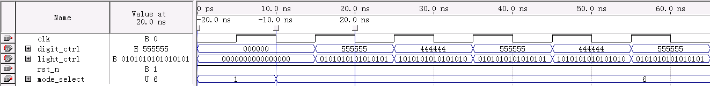

8. 将LED灯分为两部分，进行左右交换。每个数码管做左移两位运算。

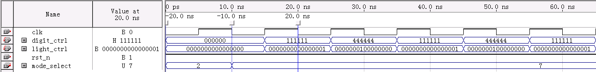

9. 将LED灯分成4个部分，1和4，2和3部分对闪，即4为1的按位取反，3为2的按位取反。数码管中，1和6, 2和5, 3和4号数码管对闪，即6为1的对9取补，5为2的对9取补，4为3的对9取补。

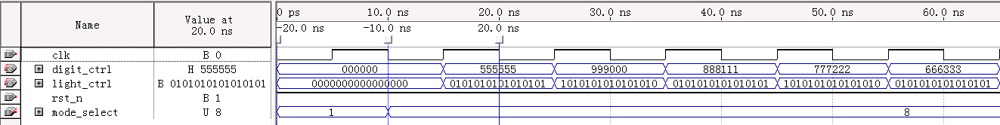

10. LED灯由两边向中间亮起（亮过的灯不会熄灭所有的灯全部亮起后，统一熄灭）。数码管从两边向中间依次亮起，具体亮起规则如下：
100001->200002->300003->410014->520025->630036->740047->851158->……->962269->000000。

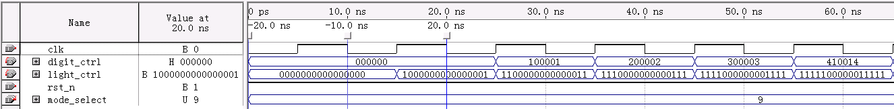

11. LED灯由中间向两边亮起 （亮过的灯不会熄灭所有的灯全部亮起后，统一熄灭）。数码管从中间向两边依次亮起，具体亮起规则如下：001100->002200->003300->014410->025520->036630->047740->158851->……->269962-> 000000。

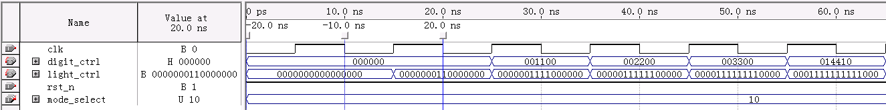

12. 将LED灯分为0000111100001111、1111000011110000、全亮和全灭四种模式，记作模式1234，分为6个节拍，亮起顺序为模式4->1->2->1->2->3->4。初始状态数码管全为1,从右向左依次变为0, 1, 2 ... 9。

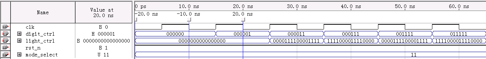

13. 将LED灯分为左右两部分，左边从两边向中间亮起，右边从中间向两边亮起。初始状态数码管全为1,从左向右依次变为0, 1, 2 ... 9。

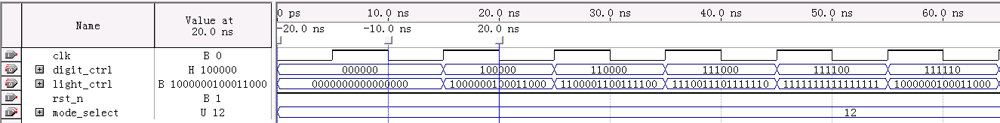

### 引脚设置与接线

要将项目下载到FPGA中，需要先在Pin Planner中绑定引脚。我们实验箱使用的FPGA芯片为EP1K30TC144-3，其芯片引脚与实验箱引脚有如下对应关系：

| 实验箱引脚 | 芯片引脚 | 实验箱引脚 | 芯片引脚 |
| ---------- | -------- | ---------- | -------- |
| 3          | 131      | 47         | 59       |
| 4          | 130      | 48         | 60       |
| 5          | 133      | 49         | 62       |
| 6          | 132      | 50         | 63       |
| 7          | 136      | 51         | 64       |
| 8          | 135      | 52         | 65       |
| 9          | 138      | 53         | 68       |
| 10         | 137      | 54         | 67       |
| 11         | 8        | 55         | 70       |
| 12         | 9        | 56         | 69       |
| 13         | 13       | 57         | 73       |
| 14         | 17       | 58         | 72       |
| 15         | 18       | 59         | 79       |
| 16         | 19       | 60         | 78       |
| 17         | 21       | CLK0（20） | 126      |
| 18         | 23       | CLK1（61） | 125      |
| 26         | 26       | CLK2（63） | 55       |
| 27         | 27       | CLK3（62） | 54       |
| 28         | 29       | 68         | 81       |
| 29         | 30       | 69         | 80       |
| 30         | 32       | 70         | 86       |
| 31         | 33       | 71         | 83       |
| 32         | 36       | 72         | 88       |
| 33         | 37       | 73         | 87       |
| 34         | 38       | 74         | 91       |
| 35         | 39       | 75         | 90       |
| 36         | 41       | 76         | 95       |
| 37         | 43       | 77         | 92       |
| 38         | 44       | 78         | 117      |
| 39         | 46       | 79         | 96       |
| 40         | 47       | 80         | 119      |
| 41         | 48       | 81         | 118      |
| 45         | 49       | 82         | 121      |
| 46         | 51       | 83         | 120      |

我们在Quartus II中对芯片引脚做如下引脚绑定：

| 引脚名         | 芯片引脚 | 引脚类型 |
| -------------- | -------- | -------- |
| digit_ctrl[0]  | 8        | output   |
| digit_ctrl[1]  | 9        | output   |
| digit_ctrl[2]  | 13       | output   |
| digit_ctrl[3]  | 17       | output   |
| digit_ctrl[4]  | 18       | output   |
| digit_ctrl[5]  | 19       | output   |
| digit_ctrl[6]  | 21       | output   |
| digit_ctrl[7]  | 23       | output   |
| digit_ctrl[8]  | 26       | output   |
| digit_ctrl[9]  | 27       | output   |
| digit_ctrl[10] | 29       | output   |
| digit_ctrl[11] | 30       | output   |
| digit_ctrl[12] | 32       | output   |
| digit_ctrl[13] | 33       | output   |
| digit_ctrl[14] | 36       | output   |
| digit_ctrl[15] | 37       | output   |
| digit_ctrl[16] | 38       | output   |
| digit_ctrl[17] | 39       | output   |
| digit_ctrl[18] | 41       | output   |
| digit_ctrl[19] | 43       | output   |
| digit_ctrl[20] | 44       | output   |
| digit_ctrl[21] | 46       | output   |
| digit_ctrl[22] | 47       | output   |
| digit_ctrl[23] | 48       | output   |
| light_ctrl[0]  | 49       | output   |
| light_ctrl[1]  | 51       | output   |
| light_ctrl[2]  | 59       | output   |
| light_ctrl[3]  | 60       | output   |
| light_ctrl[4]  | 62       | output   |
| light_ctrl[5]  | 63       | output   |
| light_ctrl[6]  | 64       | output   |
| light_ctrl[7]  | 65       | output   |
| light_ctrl[8]  | 67       | output   |
| light_ctrl[9]  | 68       | output   |
| light_ctrl[10] | 70       | output   |
| light_ctrl[11] | 69       | output   |
| light_ctrl[12] | 72       | output   |
| light_ctrl[13] | 73       | output   |
| light_ctrl[14] | 78       | output   |
| light_ctrl[15] | 79       | output   |
| rst_n          | 131      | input    |
| clk            | 132      | input    |
| mode_select[3] | 135      | input    |
| mode_select[2] | 136      | input    |
| mode_select[1] | 137      | input    |
| mode_select[0] | 138      | input    |

完成引脚设置后，再根据上面实验箱引脚与芯片引脚的对应关系和芯片引脚绑定情况，进行线路连接，具体情况如下图所示：


### 下载运行

完成线路连接后，打开Programmer，勾选Program/Configure，点击Start，即可下载至FPGA芯片中。

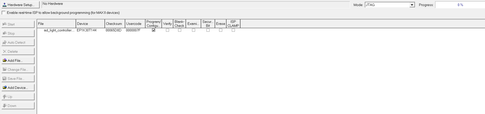

## 大型作业的心得与收获

### 李伽扬

在本次硬件大作业中，我们小组设计了一个广告灯控制器，该项目主要使用了Verilog HDL进行编程，并利用了6个数码管和16个灯来实现至少8种以上的显示模式。整个设计和实现过程让我收获颇丰，从中学到了很多关于硬件设计和FPGA开发的知识，也锻炼了我的团队协作能力和问题解决能力。以下是我在这次大作业中的一些心得与收获。

在本次项目中，我们使用Verilog HDL（硬件描述语言）编写了广告灯控制器的所有逻辑。Verilog HDL是一种描述数字电路和系统的语言，可以用来设计和验证数字电路。在学习和使用Verilog HDL的过程中，我深刻体会到了它的强大和灵活性。相比于传统的硬件设计方法，使用Verilog HDL可以更加直观地描述复杂的逻辑关系，使得我们的设计过程更加高效。

Quartus II是我们这次设计中使用的主要开发工具。这款软件提供了丰富的功能，包括代码编写、综合、仿真和下载等。通过使用Quartus II，我们能够将用Verilog HDL编写的代码转换为可以在FPGA上运行的配置文件。在使用Quartus II的过程中，我们不仅学习了如何进行代码编写和调试，还学会了如何使用其综合和仿真功能来验证我们的设计。

FPGA（现场可编程门阵列）是我们本次设计的核心硬件。FPGA具有高度的可编程性，可以通过编写硬件描述语言（如Verilog HDL）来实现各种复杂的数字逻辑电路。在本次大作业中，我们使用了数字逻辑实验箱上的FPGA芯片。通过实际操作FPGA，我们不仅对其内部结构有了更深入的了解，还掌握了如何进行硬件电路的设计和实现。

广告灯控制器的设计是本次大作业的核心内容。为了实现各种不同的显示模式，我们需要编写大量的逻辑代码，并进行反复的调试和优化。通过这次设计，我学会了如何合理地划分模块，并通过模块间的协作来实现复杂的功能。同时，我也深刻体会到了细心和耐心的重要性，因为一个小小的接线错误就可能导致整个设计显示异常。

在这次大作业中，团队协作是成功的关键。我们小组每个成员都有自己的分工，并且通过紧密的合作来完成整个项目。在项目初期，我们进行了详细的需求分析和任务分配，确保每个成员都清楚自己的职责。在项目实施过程中，我们定期进行沟通和讨论，及时解决遇到的问题。通过这次团队协作，我学会了如何更好地与他人合作，以及如何在团队中发挥自己的作用。

在项目实施过程中，我们遇到了很多问题和挑战。有些问题是由于代码编写不当引起的，有些则是由于硬件故障或软件使用不熟练造成的。面对这些问题，我们通过不断的学习和尝试，最终找到了合适的解决方案。这个过程不仅提高了我们的技术能力，也增强了我们的自信心和抗压能力。

通过本次硬件大作业，我不仅学到了很多技术知识，还积累了丰富的实践经验。这些知识和经验对我未来的学习和工作都有很大的帮助。同时，我也深刻认识到，硬件设计是一项需要高度专注和耐心的工作，需要我们不断地学习和实践。

### 靳一轩

本次计算机硬件综合大型作业以“广告灯设计”为主题，要求我们设计并实现一个具有特定功能的广告灯，旨在将理论知识与实际应用相结合，锻炼我们的电路设计、仿真、实现和调试能力，并提升团队合作和问题解决能力。在项目实施过程中，我们小组团结协作，克服重重困难，最终成功完成了广告灯的设计与实现。回顾整个项目过程，我们收获良多，不仅加深了对硬件知识的理解，还提升了专业技能和综合素质。

学校的DICE-SEM实验箱是一个功能强大且灵活的教学工具，包含了多种数字和模拟电路模块，能够模拟各种实际应用场景。在本次作业中，我不仅复习了实验箱的组成和功能，还将这些知识应用到了实际的项目中。例如，在设计广告灯时，我们需要使用实验箱中的多种模块来实现复杂的逻辑功能和实验结果显示。通过实际操作，我进一步加深了对实验箱硬件的理解，掌握了如何高效地使用这些模块进行项目开发。

FPGA 芯片的可编程性赋予我们的广告灯设计以极大的灵活性。FPGA，即现场可编程门阵列，是一种高度可编程的硬件设备，可以通过编写硬件描述语言 (HDL) 来实现各种复杂的逻辑功能。通过本次作业，我不仅学会了如何在 FPGA 上实现广告灯的设计，还深入了解了 FPGA 在嵌入式系统、通信和工业控制等领域的广泛应用。这不仅拓宽了我的知识面，也让我看到了 FPGA 在未来学习中的巨大潜力。

在编程方面，Verilog语言的学习让我受益匪浅。Verilog是一种硬件描述语言，主要用于数字电路的设计与仿真。在这次作业中，从零开始学习Verilog的基础语法，并掌握基础时序逻辑电路、组合逻辑电路的写法，还通过实践了解了模块和逻辑块的使用方法。例如，在设计广告灯时，我们需要编写多个模块来实现不同的功能，如控制信号、数码管显示模块、led等显示模块。在这个过程中，我学会了如何使用Verilog语言进行模块化编程，并且掌握了变量类型和并行执行的限制，深入理解了硬件描述语言与c语言等编程语言的不同之处，这对我的编程能力提升有很大帮助。

在Quartus II中运行编写的代码并进行仿真模拟，让我对变量类型和并行执行的限制有了更深的认识。Quartus II是一款强大的FPGA开发工具，提供了从代码编写、仿真测试到硬件下载的一整套解决方案。在这次作业中，让我看到了Quartus II在数字逻辑实验中没有用到的其他功能，例如，Quartus II可以编译Verilog语言并生成模块，以此为基础可以进一步进行波形模拟，引脚匹配，下载运行。但是Quartus II所支持的Verilog语言的版本较低，使得我们必须改进我们的代码以贴合Quartus II，通过编译，进一步提升了我们对Verilog语言的了解。

通过本次项目，我们加深了对硬件平台、FPGA 技术、Verilog 语言和仿真软件等硬件知识的理解。我们学会了如何使用 DICE-SEM 实验箱进行电路设计，如何使用 Quartus II 软件进行代码编写和仿真测试。本次项目锻炼了我们的电路设计、仿真、实现和调试能力。我们学习了如何进行电路图设计，如何编写 Verilog 代码，如何进行代码仿真测试，以及如何进行硬件调试。这些技能对于未来的学习和工作都具有重要意义。

本次项目是一次宝贵的实践机会，让我们将所学知识应用于实际项目，并完成了验收。通过本次项目，我们不仅加深了对硬件知识的理解，还提升了专业技能和综合素质。我们将以本次项目为契机，继续努力学习，不断提升自己，为未来的学习和工作打下坚实的基础。

### 欧阳裕潇

在这次硬件大作业中，我们小组使用Verilog HDL设计一个广告灯控制器，这个项目不仅是对我们所学知识的一次全面应用，也是一次极具挑战性的实践机会。通过这个项目，我们深入理解了数字电路设计的原理和实现方法，并在实际操作中提高了动手能力和解决问题的能力。

首先，我们明确了项目的目标：使用6个数码管和16个灯来组合显示至少8种以上的模式。这个目标看似简单，但在实现过程中需要考虑多方面的因素，如电路设计的复杂性、硬件资源的利用效率以及如何实现稳定可靠的显示效果。为此，我们从项目规划开始，制定了详细的设计方案。

在设计初期，我们花了大量时间进行需求分析和功能定义。我们讨论并确定了每一种显示模式的具体效果，包括数字显示、图形显示和动态效果等。同时，我们也考虑了用户的使用体验，设计了一些便于操作和切换模式的功能。接下来，我们进行了详细的电路设计和Verilog HDL代码编写。这部分工作要求我们对Verilog HDL语言有深入的理解，尤其是对其语法、语义以及模块化设计的掌握。

在实际编写代码的过程中，我们遇到了不少挑战。首先是如何高效地利用FPGA的硬件资源。由于我们的设计涉及多个数码管和灯的控制，需要占用大量的I/O引脚和逻辑单元。为此，我们采用了模块化设计的方法，将复杂的功能拆分为多个子模块，每个子模块独立完成特定的功能。通过这种方法，我们不仅简化了设计，也提高了代码的可读性和可维护性。

在项目实施过程中，Quartus II软件为我们提供了强大的支持。我们利用Quartus II的设计工具进行代码编写、仿真和调试，充分发挥了FPGA的优势。通过反复的仿真和实际测试，我们逐步优化了设计，解决了各种问题。在这个过程中，我们不仅掌握了Quartus II的使用方法，也加深了对FPGA原理和应用的理解。

本次大作业的完成，使我们深刻认识到团队合作的重要性。项目的成功离不开每一个成员的努力和贡献。从需求分析、方案设计、代码编写到调试优化，每一个环节都需要团队成员紧密配合、分工合作。通过定期的讨论和交流，我们及时发现和解决了问题，确保了项目的顺利进行。在这个过程中，我们不仅学会了如何有效沟通和协作，也增强了对团队精神的理解和认同。

此外，这次大作业也让我们认识到实践的重要性。书本上的知识只是理论，只有通过实际操作和应用，才能真正理解和掌握。在实际项目中，我们遇到了很多书本上没有提到的问题，通过解决这些问题，我们的动手能力和解决问题的能力得到了显著提高。

### 徐亚妮

本次硬件大作业中，我们小组设计和实现来一个广告灯控制器的任务。该控制器需要使用6个数码管和16个灯来组合至少8种显示模式。整个设计过程从需求分析、方案设计、代码编写、仿真验证到最终的硬件实现，我们都全程参与，并在此过程中学到了许多宝贵的知识和经验。

首先，在需求分析阶段，我们深入研究了广告灯控制器的具体功能需求，确定了所需实现的显示模式。这些模式包括静态显示、动态循环、闪烁效果等多种效果。为了使设计更加高效和可靠，我们还分析了各模式的实现难度和所需资源，从而在设计方案上进行了合理分配。

接下来，在方案设计阶段，我们决定采用Verilog HDL进行代码编写，并使用Quartus II软件进行仿真和综合。Verilog HDL是一种硬件描述语言，广泛应用于数字系统设计中。选择它作为我们的设计语言，既能保证代码的可读性和可维护性，又能充分发挥FPGA的硬件资源优势。

在具体的代码编写过程中，我们遇到了许多挑战。首先是如何合理组织和管理显示模式的代码。为了保证代码的可读性和模块化，我们将LED灯和数码管的显示都设计成独立的模块，通过顶层模块进行调用和控制。这不仅简化了代码结构，也使得各模块之间的耦合度大大降低，便于后期的调试和维护。

在实际编写过程中，我们还需要处理多种复杂的时序逻辑。例如，在动态循环模式下，需要精确控制数码管和灯的切换时间，以确保显示效果的平滑和一致。这就要求我们对Verilog HDL的时序控制语句有深入的理解，并在代码中通过适当的延时和计数器来实现精确控制。

除了代码编写，我们还进行了大量的仿真验证工作。仿真是硬件设计中至关重要的一环，通过仿真可以在不占用硬件资源的情况下验证设计的正确性。在Quartus II中，我们利用其强大的仿真功能，对每个模块进行了独立仿真，并在顶层模块中进行集成测试。通过仿真，我们及时发现并修正了一些潜在的问题，保证了最终硬件实现的正确性。

在完成仿真验证后，我们将设计下载到数字逻辑实验箱上的FPGA芯片中进行实际测试。FPGA是一种现场可编程门阵列，可以通过编程实现各种数字逻辑功能。在实际测试中，我们遇到了一些问题，例如某些显示模式的效果与预期不符。这些问题大多是由于接线质量不良以及错接引起的。通过逐步排查和调试，我们最终解决了这些问题，并实现了预期的功能。

在整个大作业的过程中，我们深刻体会到了团队合作的重要性。每个成员都充分发挥了自己的特长，密切合作，共同解决问题。通过分工协作，我们不仅提高了工作效率，也增强了团队的凝聚力和战斗力。

另外，通过本次大作业，我们对Verilog HDL和FPGA的设计流程有了更深入的理解。Verilog HDL作为一种硬件描述语言，其代码编写与传统软件编程有很大的不同，需要更加关注时序逻辑和硬件资源的合理利用。而FPGA作为一种灵活的硬件平台，其强大的并行处理能力和现场可编程特性，使其在现代电子设计中具有广泛的应用前景。

本次硬件大作业不仅锻炼了我们的实践能力，也让我们对数字系统设计有了更全面的认识。从需求分析、方案设计、代码编写、仿真验证到硬件实现，每个环节都充满了挑战和收获。我们学会了如何在复杂的项目中进行有效的分工和合作，如何合理利用硬件资源实现预期功能，如何通过仿真和调试保证设计的正确性。所有这些经验和心得都将对我们未来的学习和工作产生深远的影响。通过这次大作业，我们不仅掌握了硬件设计的基本技能，更培养了独立思考和解决问题的能力，为今后的专业学习和职业发展打下了坚实的基础。

### 申帅男

在这次硬件大作业中，我们小组共同设计并实现了一个广告灯控制器。这个控制器使用了6个数码管和16个LED灯，通过不同的组合实现了至少8种以上的显示模式。整个设计和实现过程，不仅让我们加深了对Verilog HDL的理解和应用，更是对我们团队协作、项目管理能力的一次全面考验。

首先，项目的需求分析和方案设计阶段是整个大作业的基石。我们小组在接到任务后，首先进行了一次头脑风暴，集思广益，确定了控制器的功能需求。广告灯控制器需要能够通过数码管和灯的组合，实现不同的广告效果展示，因此我们决定采用多种显示模式，如流水灯、闪烁灯。在确定了基本功能后，我们进一步细化了每种模式的具体实现方案。通过详细的讨论和反复推敲，我们最终确定了显示模式，并制定了详细的设计文档。

接下来的编码和仿真环节是整个大作业的核心部分。我们小组成员分工明确，各自负责不同模块的编码。由于广告灯控制器的功能较为复杂，包含多个子模块，因此我们采用了模块化设计的方法，这不仅提高了工作效率，也确保了每个模块的独立性和可维护性。在编码过程中，我们遇到了许多挑战和困难。例如，如何协调各个模式之间的切换等等。这些问题不仅考验了我们的Verilog编程能力，也锻炼了我们的逻辑思维和问题解决能力。

在完成编码后，我们利用Quartus II进行了详细的仿真和调试。仿真是一个发现和解决问题的重要环节。在仿真过程中，我们发现了一些设计上的不足和错误，如模式切换问题等。通过不断地仿真和调试，我们逐步优化了设计，解决了这些问题，确保了控制器的正确性和稳定性。Quartus II强大的仿真功能和丰富的调试工具为我们提供了极大的帮助，使我们能够高效地进行仿真和调试工作。

在整个项目过程中，我们不仅学到了许多专业知识，还收获了许多宝贵的经验。首先，我们深刻认识到了团队协作的重要性。一个复杂的项目需要团队成员的紧密合作和默契配合，只有通过良好的沟通和协调，才能确保项目的顺利进行。其次，我们认识到了项目管理的重要性。在项目的各个阶段，我们都进行了详细的计划和安排，确保每个阶段的工作都能按时完成。同时，我们也学会了如何在面对困难和挑战时，保持冷静和理性，通过分析问题、寻找解决方案，最终克服困难，完成任务。

此外，通过这次大作业，我们对Verilog HDL的应用有了更深入的理解。Verilog作为一种硬件描述语言，其语法和使用方法与传统的软件编程语言有很大不同。在这次项目中，我们不仅学习了Verilog的基本语法和编程技巧，还掌握了如何利用Verilog进行复杂硬件系统的设计和实现。通过实际的编码和仿真，我们对硬件描述语言的优势和局限性有了更清晰的认识，为今后的学习和研究奠定了坚实的基础。

总的来说，这次硬件大作业是一次非常有价值的实践经历。通过这个项目，我们不仅加深了对专业知识的理解和掌握，还锻炼了我们的实际动手能力和综合素质。我们深刻认识到，理论知识只有通过实践应用，才能真正转化为自己的能力和经验。这次大作业不仅是我们学习的一部分，更是我们成长的一步。未来，我们将继续努力，积极参与更多的实践项目，不断提升自己的专业能力和综合素质，为成为一名优秀的工程师而不懈努力。